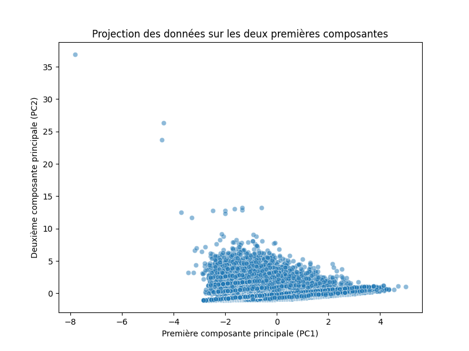
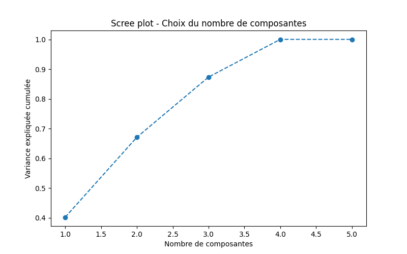

# Demission d'un organisme bancaire

## Les data

Deux datasets: demissionaires et societaires

| demissionaires | societaires |
|----------------|-------------|
| ID             | ID          |
| CDSEXE         | CDSEXE      |
| MTREV          | MTREV       |
| NBENF          | NBENF       |
| CDSITFAM       | CDSITFAM    |
| DTADH          | DTADH       |
| CDTMT          | CDTMT       |
| DTDEM          | DTDEM       |
| CDMOTDEM       | CDMOTDEM    |
| RANGAGEAD      | DTNAIS      |
| CDDEM          | BPADH       |
| CDCATCL        | CDCATCL     |
| AGEAD          |             |
| ANNEEDEM       |             |
| AGEDEM         |             |
| RANGAGEDEM     |             |
| RANGDEM        |             |
| ADH            |             |
| RANGADH        |             |

/!\ Pas de lien entre les ID des 2 tables

### Demissionaires

Nombre de demissionaires avec un revenu: 3282
___
Colonne CDSEXE

| categories | counts | freqs    |
|------------|--------|----------|
| 2          | 13180  | 0.434525 |
| 3          | 13628  | 0.449294 |
| 4          | 3524   | 0.116181 |

Valeurs presentes: 2, 3, 4

___
Colonne CDSITFAM

| categories | counts | freqs    |
|------------|--------|----------|                  
| A          | 16463  | 0.542760 |
| B          | 293    | 0.009660 |
| C          | 3424   | 0.112884 |
| D          | 1130   | 0.037254 |
| E          | 45     | 0.001484 |
| F          | 9      | 0.000297 |
| G          | 53     | 0.001747 |
| M          | 7221   | 0.238065 |
| P          | 93     | 0.003066 |
| S          | 172    | 0.005671 |
| U          | 1046   | 0.034485 |
| V          | 383    | 0.012627 |

Valeurs presentes: A, B, C, D, E, F, G, M, P, S, U, V

___
Colonne CDMOTDEM

| categories | counts | freqs    |
  |------------|--------|----------|                
| DA         | 5079   | 0.167447 |
| DV         | 23723  | 0.782111 |
| RA         | 1530   | 0.050442 |

Valeurs presentes: DA, DV, RA

___
Colonne CDCATCL

| categories | counts | freqs    |
 |------------|--------|----------|                 
| 10         | 389    | 0.012825 |
| 21         | 29005  | 0.956251 |
| 22         | 3      | 0.000099 |
| 23         | 127    | 0.004187 |
| 24         | 35     | 0.001154 |
| 25         | 711    | 0.023441 |
| 32         | 2      | 0.000066 |
| 40         | 60     | 0.001978 |

Valeurs presentes: 10, 21, 22, 23, 24, 25, 32, 40

### Societaires

Nombre de societaires demissionaires: 548
___

Colonne CDSEXE

| categories | counts | freqs    |
|------------|--------|----------|
| 1          | 161    | 0.010718 |
| 2          | 6896   | 0.459060 |
| 3          | 5859   | 0.390028 |
| 4          | 2106   | 0.140194 |

Valeurs presentes: 1, 2, 3, 4

--------------------------------------------------------

Colonne CDSITFAM

| categories | counts | freqs    |
|------------|--------|----------|
| A          | 4396   | 0.292637 |
| B          | 286    | 0.019039 |
| C          | 2794   | 0.185994 |
| D          | 721    | 0.047996 |
| E          | 153    | 0.010185 |
| F          | 34     | 0.002263 |
| G          | 273    | 0.018173 |
| M          | 4972   | 0.330981 |
| P          | 125    | 0.008321 |
| S          | 125    | 0.008321 |
| U          | 925    | 0.061576 |
| V          | 218    | 0.014512 |

Valeurs presentes: A, B, C, D, E, F, G, M, P, S, U, V

--------------------------------------------------------

Colonne CDTMT

| categories | counts | freqs    |
|------------|--------|----------|
| 0          | 6025   | 0.401078 |
| 2          | 8883   | 0.591333 |
| 4          | 98     | 0.006524 |
| 6          | 16     | 0.001065 |

Valeurs presentes: 0, 2, 4, 6

--------------------------------------------------------

Colonne CDMOTDEM

| categories | counts | freqs    |
|------------|--------|----------|
| DA         | 87     | 0.005792 |
| DC         | 336    | 0.022367 |
| DV         | 369    | 0.024564 |
| RA         | 35     | 0.002330 |
| NaN        | 14195  | 0.944947 |

Valeurs presentes: DA, DC, DV, RA

--------------------------------------------------------

Colonne CDCATCL

| categories | counts | freqs    |
|------------|--------|----------|
| 10         | 11080  | 0.737585 |
| 21         | 2703   | 0.179936 |
| 22         | 4      | 0.000266 |
| 23         | 354    | 0.023565 |
| 24         | 31     | 0.002064 |
| 25         | 686    | 0.045666 |
| 40         | 3      | 0.000200 |
| 50         | 46     | 0.003062 |
| 61         | 90     | 0.005991 |
| 82         | 24     | 0.001598 |
| 98         | 1      | 0.000067 |

Valeurs presentes: 10, 21, 22, 23, 24, 25, 40, 50, 61, 82, 98

___

Duree d'adhesion en annee

Age a la demission

Annee de demission

Revenu des societaires

Nombre d'enfants des societaires

ACP demissionaires

___

## ICI JEREMIE

- Nous avons choisi de transformer les demissionnaires en societaires afin d'avoir un unique format de donnee pour les predictions.  
- Nous n'avons conservé que certains champs de societaires. Nous avons retire les plage de valeurs, et les infos redondantes.  
- Upsample des non-demissionnaires car 2x moins nombreux 
- Colonnes du dataset et leurs types:
  - sexe                 → int64
  - revenu               → int64
  - nb_enfants           → int64
  - code_statut          → int64
  - type_client          → int64
  - adhesion_annee       → int64
  - situation_familiale  → object
  - a_demissionne        → bool
  - a_revenu             → bool
  - anciennete           → int64
- Graphes pour comparer les differents modeles + txt pour save les resultats
